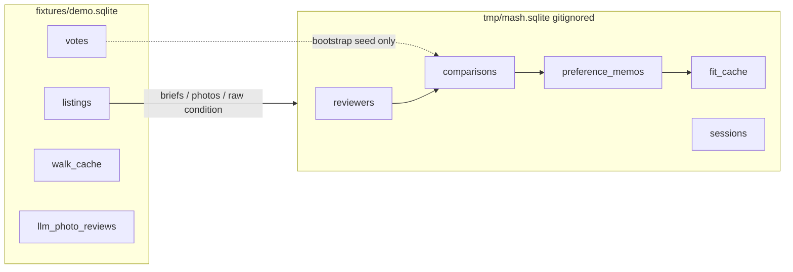

# CasitaMash

[](https://matin.github.io/casita/)

This fork adds **CasitaMash**, a FaceMash-style comparison tool on Casita's credentials-free demo fixture. You pick which of two listings you prefer.
Each pick (plus an optional written reason) feeds **Gemini via Vertex**, which updates a growing **preference memo**, re-ranks the catalog, and surfaces what it is still weighing — photos and condition stay in language (and vision) for that loop, not as lookup-table floats.
Skip, labeled hypothetical trades, and latency/bias telemetry stay.

Built on [Casita](https://matin.github.io/casita/), a personal SF/Marin rental search tool published under MIT for an interview loop.

## Run it

The intended demo path uses Vertex.
You do not need a project named `casita-mash` or any repo-specific GCP id. But you do need to create your own GCP project with billing and the Vertex AI API enabled. To do this, run `gcloud auth application-default login`, and pass **your** project id.
Step-by-step setup is in [`docs/getting-started.md`](docs/getting-started.md).

```bash
uv sync
gcloud auth application-default login
uv run casita mash --project YOUR_GCP_PROJECT
```

Replace `YOUR_GCP_PROJECT` with the project id you chose (e.g. `my-casita-mash-demo`).
On startup you should see `mash preference brain: vertex`.
Open <http://127.0.0.1:8766/mash/>.

If your gcloud default project is already set (`gcloud config set project …`), ADC login plus `uv run casita mash` is enough.
`.env` / `CASITA_GCP_PROJECT` still works.
Maps, GCS, and Firebase stay optional.

Without a GCP project (or without billing/API), `uv run casita mash` falls back to a deterministic offline stub. This is NOT the intended demo experience for the interview loop. Please ensure that the GCP project is configured with billing/API enabled.

If the UI shows a "Gemini fallback" banner with Vertex configured, a model call failed (often a temporary `429` quota/rate limit). Wait a minute and keep comparing, or check Vertex quotas on your project.

```bash
uv run casita mash anchors   # beaches, bakeries, groceries, trails we measure against
```

Also at <http://127.0.0.1:8766/mash/anchors>.

Mash reads `fixtures/demo.sqlite` and a committed POI file.
Your comparisons and preference memos live in gitignored `tmp/mash.sqlite` and never touch the fixture.



### The model loop

Casita already feeds votes and written reasons to a model as prose.
Mash extends that: each pick (plus an optional reason) goes to Gemini via Vertex, which updates a cumulative preference memo, re-ranks the catalog in the background, and surfaces model-visible moments while you keep comparing.
Photos and condition enter as language and vision, not lookup-table floats.

Your feature ranking at the start sets which levers appear on the card and which themes the memo may probe next.
The model can still mention soft signals from photos in prose, but pair steering stays inside what you ranked.

Next-pair choice is a short loop: local heuristics propose a few real tradeoffs (memo probes, rank boundaries, no dominated pairs); with Vertex, Gemini picks which pair to show and writes the why-line in one call.

1. **Preference memo:** Gemini accumulates your picks, optional written reasons, and photo reads into plain English you can read on the play screen and results page.
2. **Catalog rank:** Standings and per-listing reasons come from a memo-driven re-rank that runs in the background after each pick, so the order evolves while you compare.
3. **Next pair + why-line:** Gemini chooses from the heuristic shortlist and frames the comparison in one sentence above the cards — your memo and the tradeoff on the card, not a fixed template.
4. **Still weighing:** A short line under the why-line shows probe themes the memo has not settled yet, so the loop is legible mid-play, not only after the fact.
5. **Surprise:** When a pick clearly contradicts the memo, the model surfaces a challenge and optional "what changed?" before you continue, so preference is negotiated rather than silently overwritten.
6. **Quick question:** After enough picks, Gemini may ask one forced A/B when the memo still has ambiguity; your answer feeds the next memo update.

More schema detail is in [`docs/data-model.md`](docs/data-model.md).

## Flow

1. Enter a name.
   Sessions are isolated per person.
   There is no password.
   A cookie on `127.0.0.1` is enough for a local demo.
   If this ever left localhost, we would have to add real auth.
2. Rank the features you care about.
   These set card rows and what the memo will probe next.
   Total rent, `$/bed`, and `$/sqft` always stay on.
3. Compare pairs.
   Arrow keys or click to choose, space to skip, click a photo for the gallery.
   Watch the memo box update, the model why-line under each pair, and occasional surprise or quick-question overlays.
4. Open **Current Standings** anytime after the first pick.
   When the top 20 stops moving much, the app says so and you can see your final results.

## Why I built this

### FaceMash, on purpose

I have seen *The Social Network* an embarrassing number of times.
The dorm-window ranking scene stuck with me.
I wanted an excuse to try and build the thing.

FaceMash used Elo.
The core idea is this: people are bad at rating things and good at comparing them.
Ask someone to score an apartment out of ten and that's subjective.
Ask "A or B?" and you get a clean answer.

Casita already had a votes table and a path that feeds those votes into ranking.
In the demo fixture that loop was sitting on 16 upvotes and zero downvotes.
That is the gap I wanted to fill.

### I wanted an order to apply to the listings

Not another filter.
Filters tell you which listings have in-unit laundry.
They cannot tell you how much more you'd pay each month for in-unit laundry.
Decisions are a set of tradeoffs.
No listing wins on everything.

So my target output was a ranked list I could actually use: which places to email first, and a sense of which levers are driving that order.
Standings show model scores with per-listing reasons drawn from the preference memo — photos, vibe, and soft fields in language.

### The hard part: FaceMash only ranked one thing

Hotness is one latent trait.
One score per face is enough, which is why Elo looks so clean there.
Housing is not like that.
Two apartments differ on price, size, laundry, light, condition, and distance to a dozen places.
People also weigh those differently.
There is no universal ranking to converge on.
With about 118 eligible listings and a realistic number of comparisons, most homes show up once or not at all — you need something that generalizes from prose and photos, not one score per listing you may never see.

CasitaMash uses a feature layer for **card display** and **shortlist generation**; Gemini picks the next pair and standings come from the preference memo and model rank:

```
pick (+ optional reason) → preference memo → model ranks catalog
```

### Why you pick features first

Showing every possible row on a card buries the difference that actually decides the pair.
CasitaMash asks you to rank the features you care about and mostly shows those.
Fewer rows, faster reads, and the pairs focus on levers you could see while picking.

Your onboarding order chooses which optional features are in play.
It does not seed the memo.
New sessions start cold.
If your picks disagree with what you said you cared about, that shows up in the memo rather than getting papered over up front.

## What I tried and rejected

A few dead ends shaped the design more than the wins.

**Pure listing Elo.**
One score per listing does not survive a realistic comparison count on ~118 homes.
The multi-dimensional problem is real.

**Aggressive per-person feature pruning.**
Early numbers looked great until selection was done honestly inside each fold.
Optional features stay selectable; we do not pretend zeros are insights.

**Priors for new users.**
Tempting, and every source is contaminated: another person's memo, the old ranking prompt, or your own stated order turned into fake revealed preference.
Sessions start at zero.

**Shortlist stability as the selection objective.**
Stabilizing a full 1..n order takes hundreds of comparisons.
Getting the top 20 right takes far fewer, and nobody applies to listing 94.
The UI nudges you when the top 20 holds still.

**Generalizing to other cities.**
The repo is clear that the personal assumptions are the product.
For my own search, I'm SF-only anyway: that's where I'd move to work at Imperfect.

Fixture facts that drove these calls are in `RECON.md`.
Code lives under `src/casita/mash/`.

## Upstream Casita demo

The original static review site still works:

```bash
uv run playwright install chromium
uv run casita demo
```

Open <http://127.0.0.1:8765/>.
Same fixture, no mash database.
Live `search`, `enrich`, and `publish` remain optional and env-driven.
See `.env.example`.

## What Casita does

- Scrapes Zillow, Craigslist, Zumper, and Redfin into SQLite.
- Enriches with Gemini for facts, photo review, and ranking when credentials exist.
- Caches walk and drive minutes to SF and Marin anchors.
- Renders a static review site with votes and passes.

The domain assumptions stay personal: large dogs, SF walkability, Marin driving, trails, beaches, and good bread nearby.

## Docs

```bash
uv run zensical serve
```

Start at `docs/getting-started.md` or the [published docs](https://matin.github.io/casita/).

## Checks

```bash
make check
```

Compiles modules, runs pytest, runs the public leak validator, builds docs and the package, and checks the CLI imports.

## Contributing

Read `CONTRIBUTING.md`.
Fork it, pick something that makes Casita better, and explain why.
