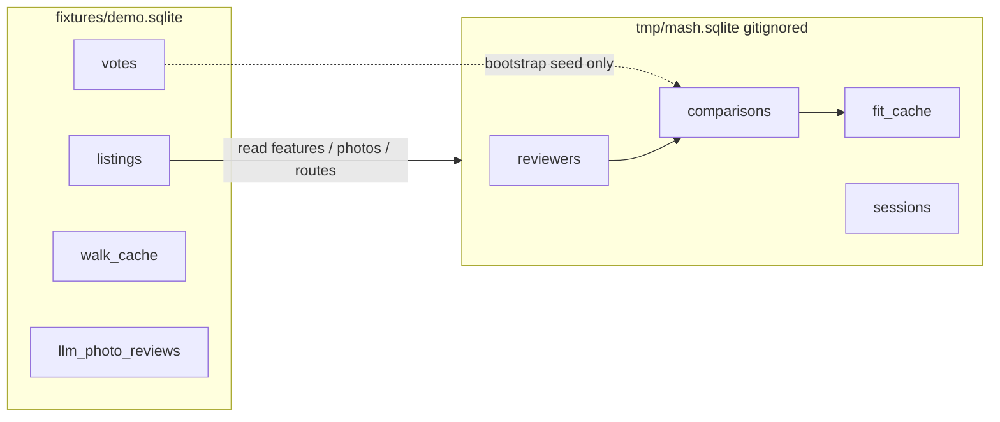

# CasitaMash

[](https://matin.github.io/casita/)

This fork adds **CasitaMash**, a FaceMash-style comparison tool on Casita's credentials-free demo fixture.
You pick which of two listings you prefer.
The app learns from those picks and ranks the whole catalog, including places you never saw.

You do not need to see every listing.
After enough comparisons, the model scores the rest from the features you cared about.
That is the point: a usable order without an exhaustive tour of the catalog.

Built on [Casita](https://matin.github.io/casita/), a personal SF/Marin rental search tool published under MIT for an interview loop.

## Run it

```bash
uv sync
uv run casita mash
```

Open <http://127.0.0.1:8766/mash/>.

```bash
uv run casita mash anchors   # beaches, bakeries, groceries, trails we measure against
```

Also at <http://127.0.0.1:8766/mash/anchors>.

Everything here is offline.
Mash reads `fixtures/demo.sqlite` and a committed POI file.
Your comparisons live in gitignored `tmp/mash.sqlite` and never touch the fixture.
No Vertex, Maps, GCS, or Firebase.



More schema detail is in [`docs/data-model.md`](docs/data-model.md).

## Flow

1. Enter a name.
   Sessions are isolated per person.
   There is no password.
   A cookie on `127.0.0.1` is enough for a local demo.
   If this ever left localhost, we would have to add real auth.
2. Rank the features you care about.
   Total rent, `$/bed`, and `$/sqft` always stay on.
3. Compare pairs.
   Arrow keys or click to choose, space to skip, click a photo for the gallery.
4. Open **Current Standings** anytime after the first pick.
   When the top 20 stops moving much, the app says so and you can see your final results.

## Why I built this

### FaceMash, on purpose

I have watched *The Social Network* an embarrassing number of times.
The dorm-window ranking scene stuck with me.
I wanted an excuse to try and build the thing.

FaceMash used Elo.
The core idea is this: people are bad at rating things and good at comparing them.
Ask someone to score an apartment out of ten and that's subjective.
Ask "A or B?" and you get a clean answer.

Casita already had a votes table and a path that feeds those votes into ranking.
In the demo fixture that loop was sitting on 16 upvotes and zero downvotes.
That is the gap I wanted to fill.

### I wanted an order to apply to the listings

Not another filter.
Filters tell you which listings have in-unit laundry.
They cannot tell you how much more you'd pay each month for in-unit laundry.
Decisions are a set of tradeoffs.
No listing wins on everything.

So my target output was a ranked list I could actually use: which places to email first, and a sense of which levers are driving that order.
Standings show the total score and, when it matters, the leftover bit that features cannot explain (photos, vibe, stuff not on the card).

### The hard part: FaceMash only ranked one thing

Hotness is one latent trait.
One score per face is enough, which is why Elo looks so clean there.
Housing is not like that.
Two apartments differ on price, size, laundry, light, condition, and distance to a dozen places.
People also weigh those differently.
There is no universal ranking to converge on.

Plain Bradley-Terry (the Elo idea done properly for offline data) learns one number per listing.
That breaks down here.
With about 118 eligible listings and a realistic number of comparisons, most homes show up once or not at all.
The model is still learning "which flat" when the useful question is "how much is this lever worth."
It also cannot score a listing you never saw.

So CasitaMash learns weights over features instead:

```
score = w · x + u
```

`w · x` is the part that generalizes to unseen listings.
`u` catches whatever the columns miss.
Learning on the order of fifteen weights takes dozens of comparisons.
Sorting 118 listings by comparison alone takes on the order of n log n picks.
That gap is the argument for the design.

### Why you pick features first

Showing every possible row on a card buries the difference that actually decides the pair.
CasitaMash asks you to rank the features you care about and mostly shows those.
Fewer rows, faster reads, and the fit focuses on levers you could see while picking.

Your onboarding order chooses which optional features are in play.
It does not seed the weights.
New sessions start cold.
If your picks disagree with what you said you cared about, that shows up in the fit rather than getting papered over up front.

## What I tried and rejected

A few dead ends shaped the design more than the wins.

**Pure listing Elo / Bradley-Terry.**
Weaker held-out accuracy than the feature model.
The multi-dimensional problem is real.

**Aggressive per-person feature pruning.**
Keeping only 3 “best” features looked smart until selection was done without peeking at the test data. 
Then it didn’t help. L2 shrinkage already soft-pedals weak features; we don’t hard-delete them.

**Priors for new users.**
Tempting, and every source is contaminated: another person's fit, the old ranking prompt, or your own stated order turned into fake revealed preference.
Sessions start at zero.

**Shortlist stability as the selection objective.**
Stabilizing a full 1..n order takes hundreds of comparisons.
Getting the top 20 right takes far fewer, and nobody applies to listing 94.
The UI nudges you when the top 20 holds still.

**Generalizing to other cities.**
The repo is clear that the personal assumptions are the product.
For my own search, I'm SF-only anyway: that's where I'd move to work at Imperfect.

Fixture facts that drove these calls are in `RECON.md`.
Code lives under `src/casita/mash/`.

## Upstream Casita demo

The original static review site still works:

```bash
uv run playwright install chromium
uv run casita demo
```

Open <http://127.0.0.1:8765/>.
Same fixture, no mash database.
Live `search`, `enrich`, and `publish` remain optional and env-driven.
See `.env.example`.

## What Casita does

- Scrapes Zillow, Craigslist, Zumper, and Redfin into SQLite.
- Enriches with Gemini for facts, photo review, and ranking when credentials exist.
- Caches walk and drive minutes to SF and Marin anchors.
- Renders a static review site with votes and passes.

The domain assumptions stay personal: large dogs, SF walkability, Marin driving, trails, beaches, and good bread nearby.

## Docs

```bash
uv run zensical serve
```

Start at `docs/getting-started.md` or the [published docs](https://matin.github.io/casita/).

## Checks

```bash
make check
```

Compiles modules, runs pytest, runs the public leak validator, builds docs and the package, and checks the CLI imports.

## Contributing

Read `CONTRIBUTING.md`.
Fork it, pick something that makes Casita better, and explain why.
