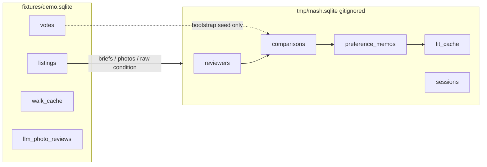

# Data Model

SQLite is the system of record for the demo and local runs. The schema lives in
`src/casita/storage.py`.

Key tables:

| Table | Purpose |
| --- | --- |
| `listings` | One row per `(source, source_id)` listing, with normalized facts and enrichment |
| `runs` | Search run history |
| `listing_status` | Funnel status such as contacted, viewing scheduled, passed on |
| `votes` | Up/down preference signal with reviewer reason |
| `actions` | Append-only log for reversible local actions |
| `llm_facts` | Cached structured fact extraction |
| `llm_photo_reviews` | Cached Gemini photo review |
| `walk_cache` | Cached walking/driving minutes by rounded coordinates |

The committed demo fixture is `fixtures/demo.sqlite`. It keeps enriched listing
facts, photo reviews, and cached route rows. It removes private conversations,
attachments, pending URLs, contact fields, and the chosen home.

## How the pieces connect

CasitaMash **reads** the fixture and **writes** only to a separate gitignored
database (`tmp/mash.sqlite`). Comparisons never mutate the committed demo file.

Mash tables (see `src/casita/mash/db.py`):

| Table | Purpose |
| --- | --- |
| `reviewers` | Name plus ranked feature order for the session |
| `comparisons` | Pairwise picks, skips, optional written reasons, hypothetical rounds |
| `preference_memos` | Growing English preference memo per reviewer (stub or Vertex) |
| `fit_cache` | Cached model ranks and memo metadata |
| `sessions` | Optional end-of-session notes |

## Ways This Could Go Further

Migrations could be formalized, or the fixture build could become a checked
script. Today, the schema is intentionally close to the personal tool that
produced it.
